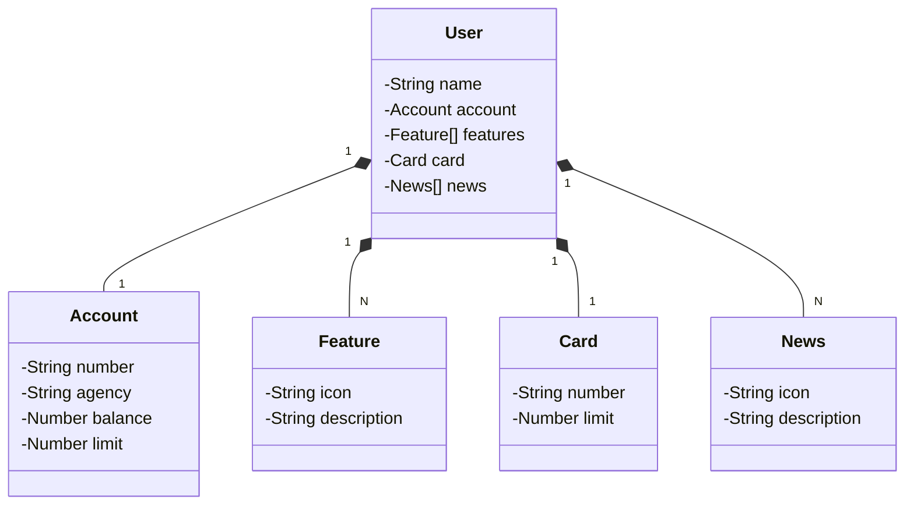

# 💳 Banking API – Projeto do Bootcamp Decola Tech 2025 (DIO)

Este repositório contém a implementação de uma API bancária desenvolvida durante o bootcamp **Decola Tech 2025** promovido pela **Digital Innovation One (DIO)**. O projeto simula operações bancárias básicas, como gerenciamento de contas, cartões e funcionalidades associadas a uma tela do app.

---

## 📐 Diagrama de Classes (Domínio da API)



---

## 🎨 Protótipo no Figma

O design e abstração do domínio da API foram elaborados utilizando o Figma, facilitando a análise e o planejamento da solução.

🔗 [Acesse o protótipo no Figma](https://www.figma.com/file/0ZsjwjsYlYd3timxqMWlbj/SANTANDER---Projeto-Web%2FMobile?type=design&node-id=1421%3A432&mode=design&t=6dPQuerScEQH0zAn-1)

---

## 🛠️ Tecnologias Utilizadas

- **Java 17**
- **Spring Boot**
- **Spring Data JPA**
- **PostgreSQL**
- **Flyway** – Controle de versionamento do banco de dados
- **Lombok** – Redução de código boilerplate
- **Swagger/OpenAPI** – Documentação interativa da API

---

## 🚀 Como Executar o Projeto

1. **Clone o repositório:**

```bash
git clone https://github.com/nataliataira/BankingAPI-DIO.git
cd BankingAPI-DIO
```

2. **Configure o banco de dados PostgreSQL:**

Crie um banco de dados chamado `banking_api` e atualize as credenciais no arquivo `application.properties`.

3. **Execute as migrações com Flyway:**

As migrações serão aplicadas automaticamente ao iniciar a aplicação.

4. **Compile e execute a aplicação:**

```bash
./mvnw spring-boot:run
```

5. **Acesse a documentação Swagger:**

Abra o navegador e vá para `http://localhost:8080/swagger-ui.html` para visualizar e interagir com os endpoints da API.

---

## 📁 Estrutura do Projeto

```bash
BankingAPI-DIO/
├── src/
│   ├── main/
│   │   ├── java/
│   │   │   └── com/
│   │   │       └── bankingapi/
│   │   │           ├── controller/
│   │   │           ├── dto/
│   │   │           ├── entity/
│   │   │           ├── repository/
│   │   │           └── service/
│   │   └── resources/
│   │       ├── db/
│   │       │   └── migration/
│   │       └── application.properties
├── .gitignore
├── Procfile
├── pom.xml
└── README.md
```

---

## 🧪 Testes

Os testes automatizados podem ser executados com o seguinte comando:

```bash
./mvnw test
```

Certifique-se de que o banco de dados de teste está configurado corretamente no arquivo `application.properties`.

---

## 📄 Licença

Este projeto está licenciado sob a Licença MIT. Consulte o arquivo [LICENSE](LICENSE) para mais informações.

---

> Desenvolvido por [Natalia Taira](https://github.com/nataliataira) durante o bootcamp Decola Tech 2025 da Digital Innovation One.
