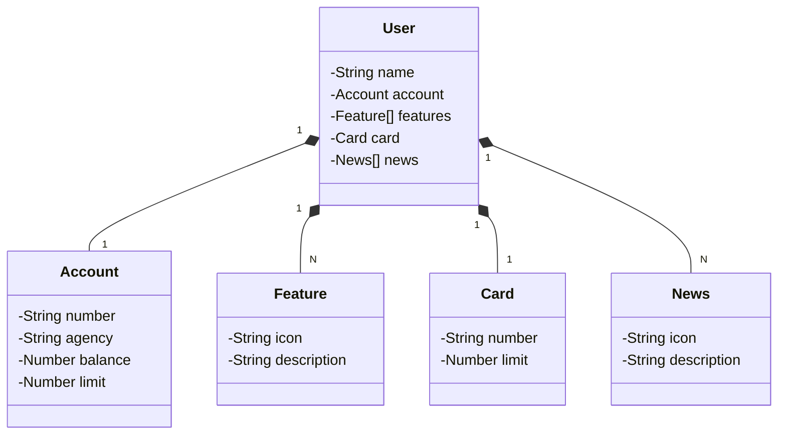

# Banking API developed in the Decola Tech 2025 bootcamp by Digital Innovation One.

## [Figma Link](https://www.figma.com/file/0ZsjwjsYlYd3timxqMWlbj/SANTANDER---Projeto-Web%2FMobile?type=design&node-id=1421%3A432&mode=design&t=6dPQuerScEQH0zAn-1)

Figma was used for the abstraction of this API's domain, being useful in the analysis and design of the solution.

## Class Diagram (API Domain)

